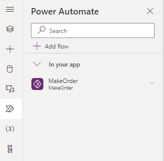

||
**WorkShop**

Create your first Canvas PowerApp with Business Central from scratch
|

Roberto Corella 

Bangkok 2024

Directions ASIA 2024
|
| :- | :-: | :- |

Scenario

Our company is working with Business Central and needs the Salespeople can have information about customers when they are out of the office.   

Requirements

- Should be mobile.
- Possibility to create a Quotation.
- Possibility to convert the quotation into order.

We will use Power Apps and Power Automate

1. **Open the Business Central Sandbox**
   
1.1 Open your browser in private mode.

1.2 Go to this website to open Business Central

      https://businesscentral.dynamics.com/ea4a9a2b-2e7a-4e7f-ba88-5a6590ed397a/DirectionsAsia2024

1.3 Press to Sign in and introduce the provided email and press Next:

1.4
 
 directionsasia01@M365B855867.onmicrosoft.com

 Introduce the provided password:  DirectionsASIA2024

 Press Sign In

1.5 Press Yes when it asks you “Stay signed in?”  (if requiere for autenticator, let me know)

1.6 Business Central Will open.  Enter the CRONUS USA Company in Sandbox DirectionsAsia.

**2 Open the Power Apps Studio**
   2.1 Press into the App Launcher to search for Power Apps (press “all apps” if you need) or enter this address directly)
   
   https://make.powerapps.com/environments/Default-ea4a9a2b-2e7a-4e7f-ba88-5a6590ed397a/home

   2.2 Press and the Power Apps will open.

**3 Create my First App**

3.1 Create a Solution by pressing “+ New Solution”

3.2 **Display Name:** DirectionsAsia_XX (where XX will be your initials)

3.3 **Publisher.**  Create a new one

**Remember the field Name cannot have spaces**

**As Prefix, you put your Initials (3 letters) and press Save.**

3.4 Choose just Create Publisher and press Create

3.5 Now you have your Solution

3.6 Create your App pressing ‘+ New’ -> App -> Canvas App**

3.7 **App Name:** Directions Salespeople XX”  (where XX will be your initials)

3.8 **Select format Tablet and press Create**

3.9 **Insert these on the screen these controls**

   3.9.1. Label
   
      3.9.1.1 Font Size: 16
      3.9.1.2 Text Alignment: Right
      3.9.1.3 Position: x 1028, y 37
      3.9.1.4 Color Font: White
      3.9.1.5 Name: Label User
      3.9.1.6 Text: User().FullName
      
   3.9.2 Rectangle
   
      3.9.2.1 Position: 0, 0
      3.9.2.2 Size: 1366, 120
      3.9.2.3 Color: "#008089"
      
   3.9.3 Label
   
      3.9.3.1 Text: SalesPeople Directions ASIA
      3.9.3.2 Font Size: 25
      3.9.3.3 Text Alignment: Center
      3.9.3.4 Position: 380, 23
      
   3.9.4 Button
   
      3.9.4.1 Text: Enter
      3.9.4.2 Color font: White
      3.9.4.3 Color Fill: "#008089"
      
3.10 **Rename Screen Name to ScreenPral**

   3.10.1 Download an image
   
   3.10.2 Background image: + Add an image

3.11 **Duplicate ScreenPral and rename the new one as ScreenMain**

4 **Connect with the Business Central API**

   4.1 Go to Data
   
   4.2 Add data
   
   4.3 Search Business Central
   
   4.4 Select Company Production – CRONUS USA
   
   4.5 Select Customer, Sales Quotes, Sales Quote Lines, and items.

5 **Adding Data Controls**

   5.1 Go to the ScreenMain
   
   5.2 Insert these controls:

The labels and buttons you can create them in the same way as before

   5.3 Insert a Drop-Down with the next properties:
   
    5.3.1 Items:  customers (v2.0)
    5.3.2 Value: (value to show) Display Name
    5.3.3 Position 52, 187
    5.3.4 Size 328, 40
    5.3.5 Chevron color: "#008089"

   5.4 Insert a Data Picker
   
     5.4.1 Position 52, 295
     5.4.2 Size: 328, 40
	 
   5.5 Insert an Image Control
   
     5.5.1 Position 47, 461
     5.5.2 Size 333, 183
	 
   5.6 Insert a Vertical Gallery
   
     5.6.1 Data Source: Items
     5.6.2 Position: 422, 179
     5.6.3 Size: 403, 544
     5.6.4 BorderColor: "#008089"	 
     5.6.5 Definition of ThisItem
       5.6.5.1 Label: ThisItem.'No.'
         5.6.5.1.1 Position: 0,0
         5.6.5.1.2 Size: 150, 40
       5.6.5.2 Label: ThisItem.'Display Name'
         5.6.5.2.1 Postion: 0, 40
         5.6.5.2.2 Size: 268, 31
         5.6.5.2.3 Font weight: Bold
       5.6.5.3 Label: Text(ThisItem.'Unit Price',"#,000.00 USD")
         5.6.5.3.1 Position: 243, 40
         5.6.5.3.2 Size: 121, 31
         5.6.5.3.3 Text alignment: Right
       5.6.5.4 TextInputQuantity
         5.6.5.4.1 Default: 0
         5.6.5.4.2 Format: Number
         5.6.5.4.3 Text alignment: Right
         5.6.5.4.4 Position: 268, 0
         5.6.5.4.5 Size: 52, 40
       5.6.5.5 IconAdd
         5.6.5.5.1 Icon: Add
         5.6.5.5.2 Position: 327, 0
         5.6.5.5.3 Size: 37, 40
       5.6.5.6 Rectangle
         5.6.5.6.1 Position: 0, 71
         5.6.5.6.2 Size: 393, 2
         5.6.5.6.3 Color: "#008089"

`  `

	5.7 Copy & Paste GalleryItems
      5.7.1 Rename the new Gallery as GalleryOrder and modify it:
      5.7.1.1 Position: 898, 179
      5.7.1.2 Size: 429, 389
      5.7.1.3 Delete the TextInputQuantity\_1
      5.7.1.4 Delete the label5\_1
      5.7.1.5 Change the icon property from Add to Trash
    5.8 Save and Play the App.

6. **Adding navigation to our App**
   
   6.1. On ScreenPral, choose “ButtonAccess”
   
   6.2 Select “OnSelect”.  OnSelect is the event that occurs when you press the button.
   
   6.3 On the fx bar insert:  *Navigate(ScreenMain)*

   6.4 On the ScreenMain, choose “ButtonBack”
   
   6.5 Select “OnSelect”
   
   6.6 On the Fx bar fill in: *Back()* 
   
   6.7 Save and Play the App.

7. **Creating a Quotation Collection**
   
   7.1 **Code for OnVisible on ScreenMain**

   7.2. **Code for Icon + Add**
   
	7.2.1 DisplayMode:
 
      If(Value(TextInputQuantity.Text)>0,DisplayMode.Edit,DisplayMode.Disabled)
	  
    7.2.2 OnSelect:

    7.2.3 Code for Icon Trush

    7.2.4 Code for label TotalAmount

8 **Creating a Quotation in Business Central**

   8.1 **Code for Create Quote Button**
      
	  8.1.1 DisplayMode

      8.1.2 OnSelect

9 **From Quote to Order**

   9.1 **Create a Power Automate**

Press + Create a Flow and Add an Input:  

Type: Text

` `Name: ID

Next Step:

Select the Business Central connector:

In the action select: RUN ACTION (V3)

Select the environment and company.

Choose the API Category: V2.0

Action Name: salesQuote-makeOrder

Id:  Dynamic content is the Parameter from Power Apps (ID)

Rename the flow:  MakeOrder\_XX, where XX are your initials.

Save it.  The flow is now in the App

9.2 **Code for Convert to Order Button**

`        `

.

10 **Publish your Application**

11. **Sharing your App**

