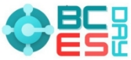
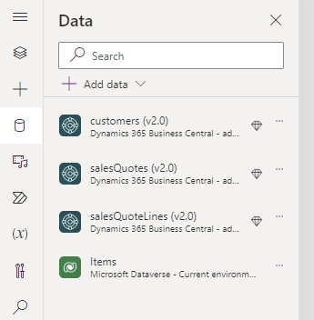
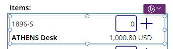
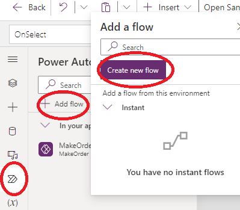
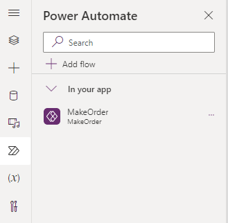
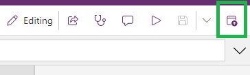

||
**WorkShop**

Create your first Canvas PowerApp with Business Central from scratch
|

Roberto Corella & Javier Armesto

November 2023

Directions EMEA Lyon
|
| :- | :-: | :- |

Scenario

Our company is working with Business Central and needs the Salespeople can have information about customers when they are out of the office.   

Requirements

- Should be mobile.
- Possibility to create a Quotation.
- Possibility to convert the quotation into order.

We will use Power Apps and Power Automate

1. **Open the Business Central Sandbox**
1.1 Open your browser in private mode.
1.2 Go to this website to open Business Central
       https://businesscentral.dynamics.com/
1.3 Press to Sign in and introduce the provided email and press Next:

 aprendebc03@M365B855867.onmicrosoft.com

Introduce the provided password:  DirectionsEMEA2023

Press Sign In

Press Yes when it asks you “Stay signed in?”
Business Central Will open.  Enter the CRONUS USA Company in Sandbox Canvas.

**Open the Power Apps**
   1. Press into the App Launcher a search for Power Apps (press “all apps” if you need)

Press and the Power Apps will open.

**My First App**

1. Create a Solution by pressing “+ New Solution”

**Display Name:** Directions XX (where XX will be your initials)
**Publisher.**  Create a new one

**Remember the field Name cannot have spaces**

**As Prefix, you put your Initials (3 letters) and press Save.**

**Choose just Create Publisher and press Create**

**Now you have your Solution**

**Create your App pressing ‘+ New’ -> App -> Canvas App**

**App Name:  “**Directions Salespeople XX”  (where XX will be your initials)
**Select format Tablet and press Create**

**Insert these on the screen these controls**
   1. **Label**
      1. Font Size: 16
      1. Text Alignment: Right
      1. Position: x 1028, y 37
      1. Color Font: White
      1. Name: Label User
      1. Text: User().FullName
   1. Rectangle
      1. Position: 0, 0
      1. Size: 1366, 120
      1. Color: "#008089"
   1. Label
      1. Text: SalesPeople Directions
      1. Font Size: 25
      1. Text Alignment: Center
      1. Position: 380, 23
   1. Button
      1. Text: Enter
      1. Color font: White
      1. Color Fill: "#008089"
1. **Rename Screen Name to ScreenPral**
   1. Download an image
   1. Background image: + Add an image

1. **Duplicate ScreenPral and rename the new one as ScreenMain**

1. **Connect with the Business Central API**
   1. Go to Data
   1. Add data
   1. Search Business Central
   1. Select Company Production – CRONUS USA
   1. Select Customer, Sales Quotes, Sales Quote Lines, and items.

1. **Adding Data Controls**
   1. Go to the ScreenMain
   1. Insert this controls:

The labels and buttons you can create them in the same way as before

1. Insert a Drop-Down with the next properties:
   1. Items:  customers (v2.0)
   1. Value: (value to show) Display Name
   1. Position 52, 187
   1. Size 328, 40
   1. Chevron color: "#008089"
1. Insert a Data Picker
   1. Position 52, 295
   1. Size: 328, 40
1. Insert an Image Control
   1. Position 47, 461
   1. Size 333, 183
1. Insert a Vertical Gallery
   1. Data Source: Items
   1. Position: 422, 179
   1. Size: 403, 544
   1. BorderColor: "#008089"
   1. Definition of ThisItem
      1. Label: ThisItem.'No.'
         1. Position: 0,0
         1. Size: 150, 40
      1. Label: ThisItem.'Display Name'
         1. Postion: 0, 40
         1. Size: 268, 31
         1. Font weight: Bold
      1. Label: Text(ThisItem.'Unit Price',"#,000.00 USD")
         1. Position: 243, 40
         1. Size: 121, 31
         1. Text alignment: Right
      1. TextInputQuantity
         1. Default: 0
         1. Format: Number
         1. Text alignment: Right
         1. Position: 268, 0
         1. Size: 52, 40
      1. IconAdd
         1. Icon: Add
         1. Position: 327, 0
         1. Size: 37, 40
      1. Rectangle
         1. Position: 0, 71
         1. Size: 393, 2
         1. Color: "#008089"

`                                 `

1. Copy & Paste GalleryItems
   1. Rename the new Gallery as GalleryOrder and modify it:
      1. Position: 898, 179
      1. Size: 429, 389
      1. Delete the TextInputQuantity\_1
      1. Delete the label5\_1
      1. Change the icon property from Add to Trash
1. Save and Play the App.

1. **Adding navigation to our App**
   1. On ScreenPral, choose “ButtonAccess”
   1. Select “OnSelect”.  OnSelect is the event that occurs when you press the button.
   1. On the fx bar insert:  *Navigate(ScreenMain)*

1. On the ScreenMain, choose “ButtonBack”
1. Select “OnSelect”
1. On the Fx bar fill in: *Back()* 
1. Save and Play the App.
1. **Creating a Quotation Collection**
   1. **Code for OnVisible on ScreenMain**

1. **Code for Icon + Add**
   1. **DisplayMode:**
      1. *If(Value(TextInputQuantity.Text)>0,DisplayMode.Edit,DisplayMode.Disabled)*
   1. **OnSelect:**

1. **Code for Icon Trush**

1. **Code for label TotalAmount**

1. **Creating a Quotation in Business Central**
   1. **Code for Create Quote Button**
      1. **DisplayMode**

1. **OnSelect**

1. **From Quote to Order**
   1. **Create a Power Automate**

Press + Create a Flow and Add an Input:  

Type: Text

` `Name: ID

Next Step:

Select the Business Central connector:

In the action select: RUN ACTION (V3)

Select the environment and company.

Choose the API Category: V2.0

Action Name: salesQuote-makeOrder

Id:  Dynamic content is the Parameter from Power Apps (ID)

Rename the flow:  MakeOrder\_XX, where XX are your initials.

Save it.  The flow is now in the App

1. **Code for Convert to Order Button**

`        `

.

1. **Publish your Application**

1. **Sharing your App**

